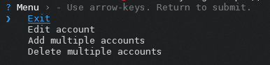
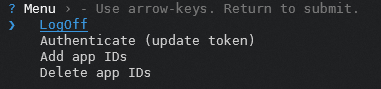
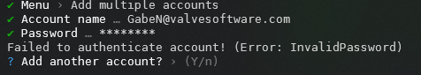

# Steam hour booster
Tool for boosting your in-game time

---

### How to use

1. Install [NodeJS](https://nodejs.org/) (developed on 18.17.0 LTS)
1.2. Install yarn with `npm i -g yarn` if it's not installed
2. Clone repo, install dependencies and build project
```sh
git clone https://github.com/TheSainEyereg/steam-hour-booster.git
cd steam-hour-booster
yarn
yarn build
```
3. Run `yarn start` and on the first run you will be prompted to add new accounts, otherwise it will automatically log you in to those already added.

### Screenshots

**Main menu:**  
  
**Edit account:**  
  
**Add account:**  
  
